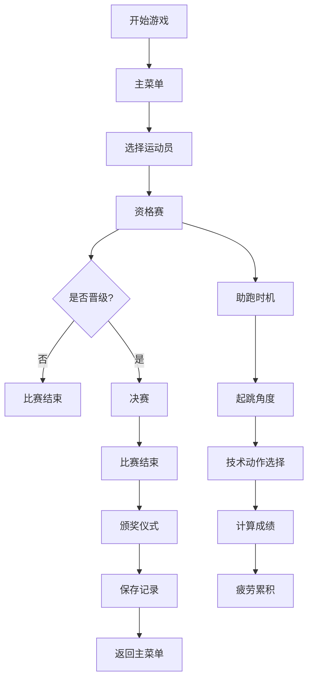

## 1. 产品概述

跳高田径运动会模拟游戏，玩家控制虚拟运动员参加跳高比赛，体验从资格赛到决赛的完整赛事流程。游戏融合策略性与操作性，玩家需要根据风速、疲劳度等环境因素选择技术动作，与不同风格的AI对手竞技。

- 核心玩法：策略性跳高比赛，结合时机把握与战术决策
- 目标用户：体育游戏爱好者、休闲游戏玩家
- 产品价值：提供沉浸式田径运动体验，展现跳高运动的技术魅力

## 2. 核心功能

### 2.1 用户角色

| 角色 | 注册方式 | 核心权限 |
|------|----------|----------|
| 玩家 | 无需注册，本地存储 | 参与比赛、查看历史记录、调整游戏设置 |

### 2.2 功能模块

1. **主菜单页面**：游戏入口、快速开始、历史记录、游戏说明
2. **比赛页面**：资格赛、决赛、实时比赛画面
3. **比赛控制**：助跑时机、起跳角度、过杆技术选择
4. **AI对手系统**：多种技术风格的AI运动员
5. **颁奖仪式**：比赛结果展示、奖牌颁发
6. **历史记录**：过往比赛数据统计与查询

### 2.3 页面详情

| 页面名称 | 模块名称 | 功能描述 |
|----------|----------|----------|
| 主菜单 | 游戏入口 | 开始新游戏、继续游戏、查看历史 |
| 主菜单 | 游戏说明 | 操作指南、规则介绍 |
| 比赛准备 | 运动员选择 | 选择运动员属性、定制风格 |
| 资格赛 | 比赛流程 | 3次试跳机会，达到及格线晋级 |
| 决赛 | 比赛流程 | 横杆逐步升高，决出名次 |
| 比赛界面 | 实时数据 | 风速、疲劳度、当前高度、剩余试跳 |
| 比赛界面 | 操作控制 | 助跑滑块、起跳时机按钮、技术选择 |
| 比赛界面 | 角色动画 | 骨骼动画展示助跑、起跳、过杆、落地 |
| 颁奖仪式 | 结果展示 | 排名、成绩、奖牌颁发动画 |
| 历史记录 | 数据展示 | 过往比赛成绩、最佳记录、统计分析 |

## 3. 核心流程

## 4. 用户界面设计

### 4.1 设计风格

**设计方向：运动竞技感 + 现代简约**

- 主色调：活力橙 (#FF6B35) 作为主色，代表热情与力量
- 辅助色：深邃蓝 (#004E89) 代表专业与沉稳，金色 (#FFD700) 用于奖牌和高光
- 中性色：深灰 (#1A1A2E) 背景，浅灰 (#F7F7F7) 内容区
- 按钮风格：圆润立体按钮，带有微妙阴影和悬停动效
- 字体：展示字体使用 "Anton" 或 "Oswald" 增强运动感，正文字体使用 "Inter" 保证可读性
- 布局风格：卡片式布局，层次分明，信息聚焦
- 图标风格：线性图标结合运动元素，简洁有力

### 4.2 页面设计概述

| 页面名称 | 模块名称 | UI 元素 |
|----------|----------|---------|
| 主菜单 | Hero 区域 | 大标题动态入场、背景运动场渐变、装饰性跑道线条 |
| 主菜单 | 菜单按钮 | 卡片式按钮，悬停上浮效果，图标+文字组合 |
| 比赛界面 | 场景区域 | 2D/3D 混合场景，跑道、横杆、沙坑，骨骼动画角色 |
| 比赛界面 | 数据面板 | 半透明玻璃态面板，实时数据展示，动画数值变化 |
| 比赛界面 | 控制区域 | 大型操作按钮，力度滑块，技术选择卡片 |
| 颁奖仪式 | 领奖台 | 3D 领奖台，聚光灯效果，奖牌动画，彩带飘落 |
| 历史记录 | 数据列表 | 时间线布局，成绩卡片，展开详情动画 |

### 4.3 响应式

- 桌面优先设计，自适应 1280px 以上宽度
- 移动端优化触控区域，按钮最小 48x48px
- 场景区域在小屏幕上自适应缩放
- 控制面板在移动端改为底部固定布局

### 4.4 动画与动效

- 页面加载：元素错落入场动画，主标题扫光效果
- 角色动画：骨骼动画实现流畅的助跑、起跳、过杆动作
- 交互反馈：按钮按下缩放，滑块实时力度反馈
- 转场效果：页面间平滑淡入淡出，比赛结果弹窗弹性动画
- 粒子效果：起跳尘土、过杆彩带、颁奖礼炮

## 5. 游戏机制

### 5.1 核心参数

- **风速**：-5.0 m/s 到 +5.0 m/s，顺风加分，逆风减分
- **疲劳度**：0-100，每次试跳增加，影响发挥
- **起跳角度**：40°-50° 为最佳区间
- **助跑速度**：由玩家操作时机决定

### 5.2 技术动作

| 技术风格 | 特点 | 适用场景 |
|----------|------|----------|
| 俯卧式 | 传统技术，稳定性高 | 适合初学者 |
| 背越式 | 现代主流，潜力大 | 需要精准控制 |
| 跨越式 | 简单易学，上限低 | 低高度比赛 |

### 5.3 AI 对手类型

| AI 类型 | 技术风格 | 策略特点 |
|---------|----------|----------|
| 稳健型 | 俯卧式 | 求稳，保守选择高度 |
| 冲击型 | 背越式 | 激进，敢于挑战高度 |
| 平衡型 | 混合式 | 综合能力强，发挥稳定 |
