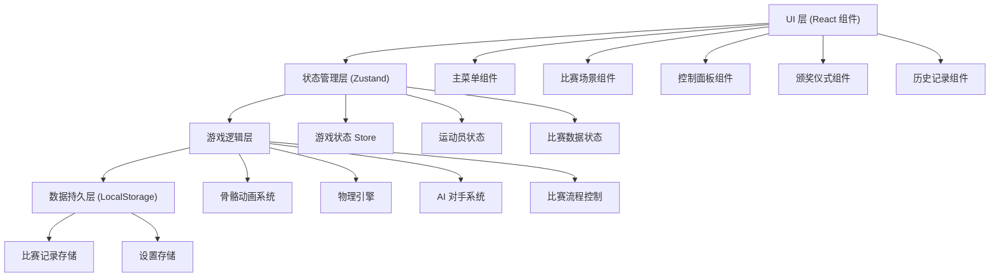
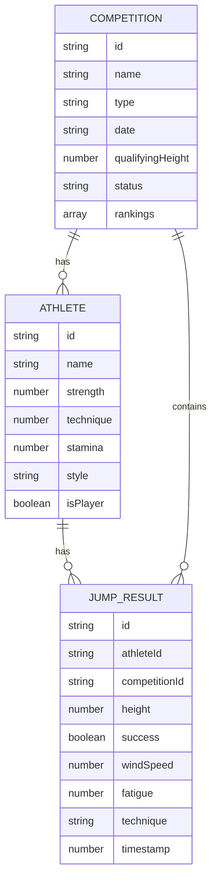

## 1. 架构设计



## 2. 技术栈描述

- **前端框架**: React@18.3.1 + TypeScript@5.8.3
- **构建工具**: Vite@6.3.5
- **样式方案**: Tailwind CSS@3.4.17
- **状态管理**: Zustand@5.0.3
- **路由管理**: React Router DOM@7.3.0
- **动画库**: Framer Motion@11.0.0
- **2D 渲染**: Canvas API (原生)
- **骨骼动画**: 自定义 2D 骨骼系统
- **数据持久化**: LocalStorage
- **图标库**: Lucide React@0.511.0
- **后端**: 无 (纯前端应用)
- **数据库**: LocalStorage (模拟)

## 3. 目录结构

```
src/
├── components/          # 通用组件
│   ├── Empty.tsx
│   ├── Bone.tsx        # 骨骼组件
│   ├── Skeleton.tsx    # 骨骼动画组件
│   └── Athlete.tsx     # 运动员渲染组件
├── pages/              # 页面组件
│   ├── Home.tsx        # 主菜单
│   ├── Game.tsx        # 比赛页面
│   ├── Award.tsx       # 颁奖页面
│   └── History.tsx     # 历史记录
├── store/              # 状态管理
│   └── useGameStore.ts # 游戏状态 Store
├── game/               # 游戏逻辑
│   ├── types.ts        # 类型定义
│   ├── constants.ts    # 游戏常量
│   ├── physics.ts      # 物理计算
│   ├── animation.ts    # 骨骼动画系统
│   ├── ai.ts           # AI 对手逻辑
│   ├── competition.ts  # 比赛流程控制
│   └── storage.ts      # 数据持久化
├── hooks/              # 自定义 Hooks
│   ├── useTheme.ts
│   └── useGameLoop.ts  # 游戏循环 Hook
├── lib/                # 工具库
│   └── utils.ts
├── App.tsx
├── main.tsx
└── index.css
```

## 4. 路由定义

| 路由 | 页面 | 用途 |
|------|------|------|
| `/` | Home | 主菜单页面 |
| `/game` | Game | 比赛主界面 |
| `/award` | Award | 颁奖仪式页面 |
| `/history` | History | 历史记录页面 |
| `/tutorial` | Tutorial | 游戏教程页面 |

## 5. 数据模型

### 5.1 数据模型定义



### 5.2 TypeScript 类型定义

```typescript
// 运动员类型
interface Athlete {
  id: string;
  name: string;
  strength: number;      // 力量 0-100
  technique: number;     // 技术 0-100
  stamina: number;       // 耐力 0-100
  style: JumpStyle;      // 技术风格
  isPlayer: boolean;
  fatigue: number;       // 疲劳度 0-100
}

// 跳跃技术
type JumpStyle = 'straddle' | 'fosbury' | 'scissors';

// 跳跃结果
interface JumpResult {
  id: string;
  athleteId: string;
  competitionId: string;
  height: number;
  success: boolean;
  windSpeed: number;
  fatigue: number;
  technique: JumpStyle;
  timestamp: number;
  attemptNumber: number;
}

// 比赛阶段
type CompetitionPhase = 'qualifying' | 'final' | 'finished';

// 比赛状态
interface Competition {
  id: string;
  name: string;
  type: 'qualifying' | 'final';
  date: string;
  qualifyingHeight: number;
  currentHeight: number;
  phase: CompetitionPhase;
  athletes: Athlete[];
  results: JumpResult[];
  currentAthleteIndex: number;
  attemptsRemaining: Map<string, number>;
  rankings: Ranking[];
}

// 排名
interface Ranking {
  athleteId: string;
  bestHeight: number;
  attempts: number;
}

// 游戏状态
interface GameState {
  phase: 'menu' | 'preparing' | 'running' | 'jumping' | 'result' | 'award';
  competition: Competition | null;
  playerAthlete: Athlete | null;
  windSpeed: number;
  runUpProgress: number;
  jumpAngle: number;
  selectedTechnique: JumpStyle;
  animationFrame: number;
}
```

## 6. 核心算法

### 6.1 跳跃成功判定公式

```
成功概率 = 基础成功率 × 技术修正 × 风速修正 × 疲劳修正 × 角度修正

基础成功率 = (力量 × 0.4 + 技术 × 0.6) / 100
技术修正 = 1.0 (背越式) / 0.95 (俯卧式) / 0.85 (跨越式)
风速修正 = 1.0 + (风速 × 0.02)  [范围: -5 到 +5 m/s]
疲劳修正 = 1.0 - (疲劳度 × 0.005)
角度修正 = 1.0 - |起跳角度 - 45| × 0.02

实际跳跃高度 = 基础高度 × (1 + 随机扰动 ± 5%)
基础高度 = 1.5 + (力量 × 0.01) + (技术 × 0.008)  [米]
```

### 6.2 AI 决策算法

- **稳健型**: 选择比最佳成绩低 5cm 的高度，成功率优先
- **冲击型**: 选择比最佳成绩高 5cm 的高度，追求突破
- **平衡型**: 根据剩余试跳次数动态调整策略

## 7. 性能优化

- 使用 Canvas 进行骨骼动画渲染，避免 DOM 重排
- 实现对象池复用粒子效果
- 使用 requestAnimationFrame 进行游戏循环
- LocalStorage 数据异步读写，避免阻塞主线程
- 图片资源使用 WebP 格式，按需加载
